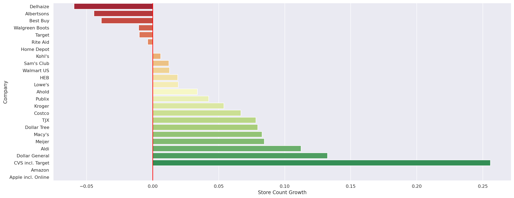

# proyecto-datacademy

## Contexto: analista de datos en retail

Imagina que acabas de iniciar tu primer trabajo como Data Analyst para una nueva empresa de retail en Estados Unidos. Managers de ventas quieren conocer ciertos aspectos de otras empresas y te piden analizar datos de otras 25 compañías muy exitosas en el país.

Puedes revisar tambien este proyecto en mi perfil de [Deepnote](https://deepnote.com/project/Proyecto-Datacademy-saID2GGgRp6xdRZEKfybXA/%2Fproyecto-datacademy%2Fproyecto_datacademy.ipynb)

A sido usado una versión adaptada y simplificada del dataset [Largest US Retailers](https://www.kaggle.com/yamqwe/largest-us-retailers-2015e) de Yam Peleg en Kaggle.

## 🔗 Links

## Screenshots

## 🛠 Skills
Python 3, Pandas, Matplotlib, Seaborn, Numpy, Jupyter Notebooks

## 🚀 About Me
I am a Data Scientist 👨‍💻 | Data Engineer in progress ⚡ | Msc of mechanical engineering 👨‍🔬 & Mechanical Engineer 👨‍🔧
- [@FaustinoAndres](https://github.com/FaustinoAndres)
